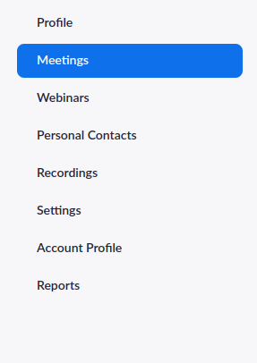
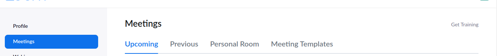
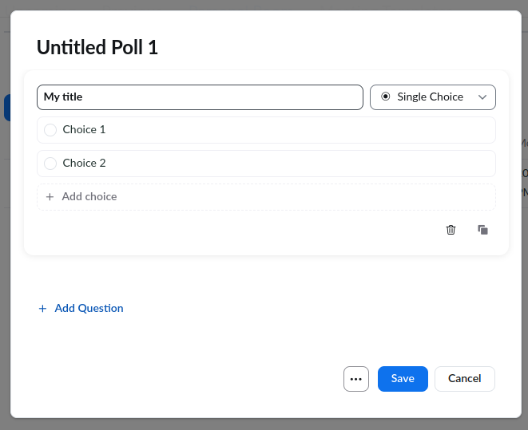
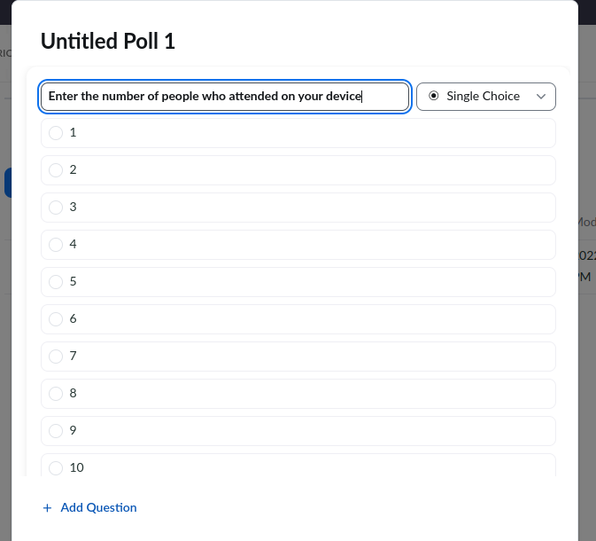

# Zoom Count
Welcome to zoom count, this application enables you to get the exact total for all your attendees in zoom instantly provided the attendance poll report.

You will need to set up a zoom poll which allows your attendees to enter the number of people who attended using their device.

You will also need a twilio account to use their API, you can do so at this <a href="https://www.twilio.com/">link</a>

## Requirements
1. python3.10.4
2. Virtual env
3. pandas==1.4.3
4. python-decouple==3.6
5. twilio==7.12.0

You will find a full list of requirements listed in the requirements.txt file found in this project.

## Technologies
1. Python
2. Twilio

## Setting Up In Local Environment
1. Clone the repo from github using the command ``` git clone https://github.com/Ken-mbira/zoom_count.git ```
2. Navigate to the base directory of the project that is zoom_count on the terminal
3. Create a new virtual environment with the command ``` python3 -m venv virtual --without-pip ```
4. Activate the virtual environment with the command ``` source virtual/bin/activate ```
5. Install pip using the command ``` curl https://bootstrap.pypa.io/get-pip.py -o get-pip.py ``` followed by ``` python get-pip.py ``` then ``` rm get-pip.py ```
6. Install all the dependencies using ``` pip install -r requirements.txt ```
7. Create a folder in this directory called <b>staging</b> using the command ```mkdir staging```
8. Create a file in this directory called <b>.env</b> using the command ``` touch .env ```
9. then move inside the .env file and paste the following:
    ```
        TWILIO_ACCOUNT_SID=<your twilio account sid>
        TWILIO_ACCOUNT_TOKEN=<your twilo account token>
        TWILIO_NUMBER=<the number generated for you by twilio>
        RECEIVER_NUMBER=<the number you want to receive the text>
        RECEIVER_NAME='<your name>'
    ```
10. Then run the project using ``` python run.py ```

## Setting Up Zoom Poll
1. Log into your zoom web portal
2. Click on the Meetings tab on the left navigation bar
    
3. Next select Personal room from the top navigation bar
    
4. Then select polls on the tab right below the above
5. Then click on the create button that appears and start cusomizing your poll
6. Enter a title and on the right of the title select Single Choice from the dropdown.
   
7. Proceed to add the choices to 10, <small>That's as far as they can go unfortunately</small>.
8. Edit the choices to be only numerical values like so...
   
9. You might also want to change the heading of your poll to something the attendees will understand.

At this point you should have the zoom poll ready to run, at any point during the meeting you may launch it and end it after the attendees have some time to select their answers. Once you launch it, it will appear as a dialog to your users asking them what you set as the heading, hence the informative heading.

After ending a poll you need a csv file that you could download immediately when you end it,
- [x] After clicking end poll, you will see three dots taking the place of the end poll button, click them then select Download results and choose the download location to be the staging folder we created above. Then just wait for the message to be received
